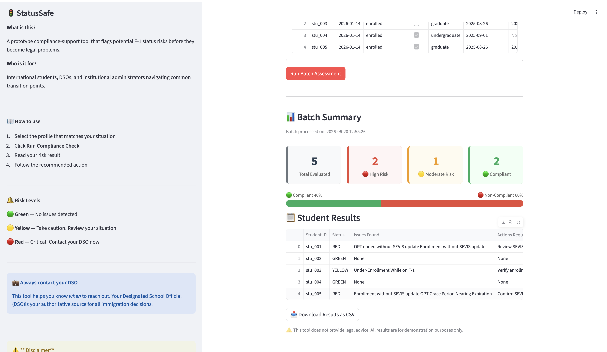

# StatusSafe
StatusSafe is a side-project prototype that explores how institutional coordination failures between course registration and international student services can lead to unintentional F-1 status violation issues.

This project proposes a compliance-support tool that flags potential risks early,before they become legal problems. It is designed as a preventive, decision-support layer that helps identify gaps during common transitions for example undergraduate to OPT, OPT to graduate enrollment where students may be acting in good faith but institutional systems fail to align.

**This is a demonstration project only.** It does not provide legal advice and does not interact with real sevis data or student data. All examples use mock data for illustration and educational purposes.

**The GOAL:** Spot and reduce unintentional immigration risk by improving institutional visibility, cordination, and early warning mechanisms.

---

## live demo
🚦 [statussafe.streamlit.app](https://statussafe.streamlit.app)


---

## Phase 1 Features
- Rules engine with 5 F-1 compliance rules according to USCIS
- Individual student risk assesment uisng mock profiles
- Three levels of risk output - RED, YELLOW & GREEN
- Severity precedence; critical overides warning
- Seven samples profiles covering all risk scenarios
- Veified test where all samples passed 
- Terminal compliance report
- Deployed live at statussafe.streamlit.app

---

## Phase 2 Features
- CSV batch upload for institutional use with a max of 500 student records.
- Input validation. All 8 required fields are checked before data processing 
- Boolean and string normalisation. Handles pandas data type gracefully
- NaN handling, empty opt_end_date treated as absent
- Case insensitive enrollment status and program level
- Batch processing engine. Invalid rows are skipped without stopping the batch
- Visual batch summary dashboard with color coded metrics
- Split compliance and non-compliance bar
- Timestanp for every batch assessment
- Results table with full rule names and recommended action
- Results sorted by risk level - RED first then YELLOW then GREEN
- Download batch results as CSV
- Persistent results using session state
- Individual student self check form. 'Check my own status'
- Edge case test suite- all 17 test pass
- Expanded data schema documentation for Phase 2

---

## Data Schema

Each student record requires these fields:

| Field | Type | Required | Notes |
|---|---|---|---|
| student_id | string | yes | Alphanumeric |
| today | date | yes | YYYY-MM-DD |
| enrollment_status | enum | yes | enrolled, not_enrolled |
| full_time | boolean | yes | true, false |
| program_level | enum | yes | graduate, undergraduate |
| program_start_date | date | yes | YYYY-MM-DD |
| opt_end_date | date | no | YYYY-MM-DD, omit if not on OPT |
| sevis_updated | boolean | yes | true, false |

See `docs/data_schema.md` for full documentation.

## Note on analytics
The Compliance analytics sesction requires a local database to display historical assessments. 
On the live demo, at statusafe.streamlit.app, run a batch assessment first to populate the analytics dashboard. 

---

## How To Run Locally

```bash
# Clone the repository
git clone https://github.com/muchuki77/StatusSafe.git
cd StatusSafe

# Create and activate virtual environment
python -m venv .venv
source .venv/bin/activate

# Install dependencies
pip install -r requirements.txt

# Run the app
python -m streamlit run src/app.py
```

---

## Project Structure

StatusSafe/

docs/           — documentation and schema

samples/        — mock student profiles for testing

src/

app.py        — Streamlit interface

rules_engine.py — compliance rules and batch processing

tests/          — verification and edge case test scripts

requirements.txt

LICENSE

README.md

---

## Disclaimer

This tool does not provide legal advice. It does not interact with real SEVIS data or student records. All profiles and results are for demonstration and educational purposes only. 

Always consult your Designated School Official (DSO) for immigration guidance.

---

## Author

Maryanne Muchuki

Built: 2026

Inspired by personal experience navigating F-1 status reinstatement.

---

## License

MIT License — see LICENSE file for details.


